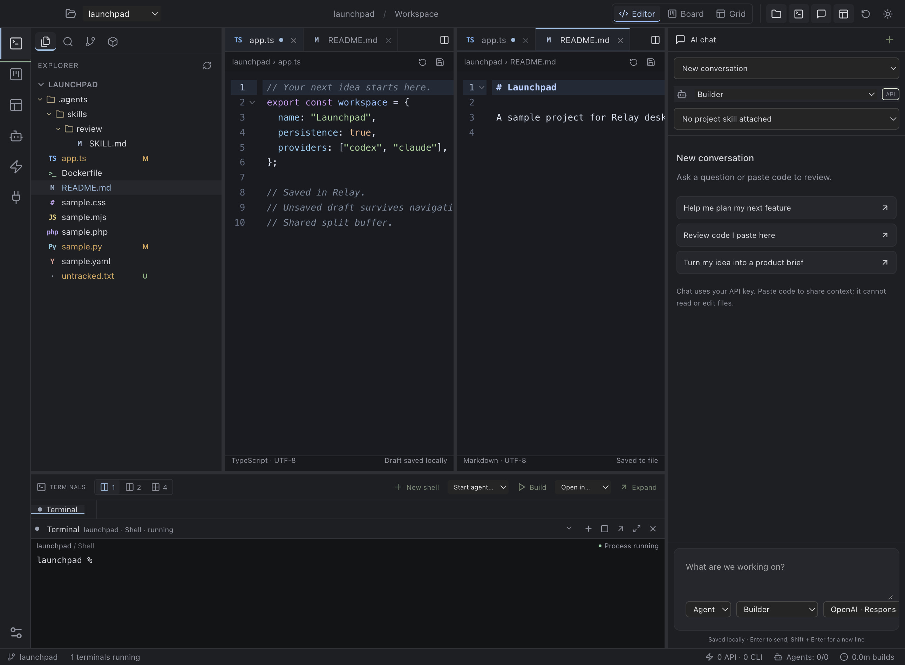
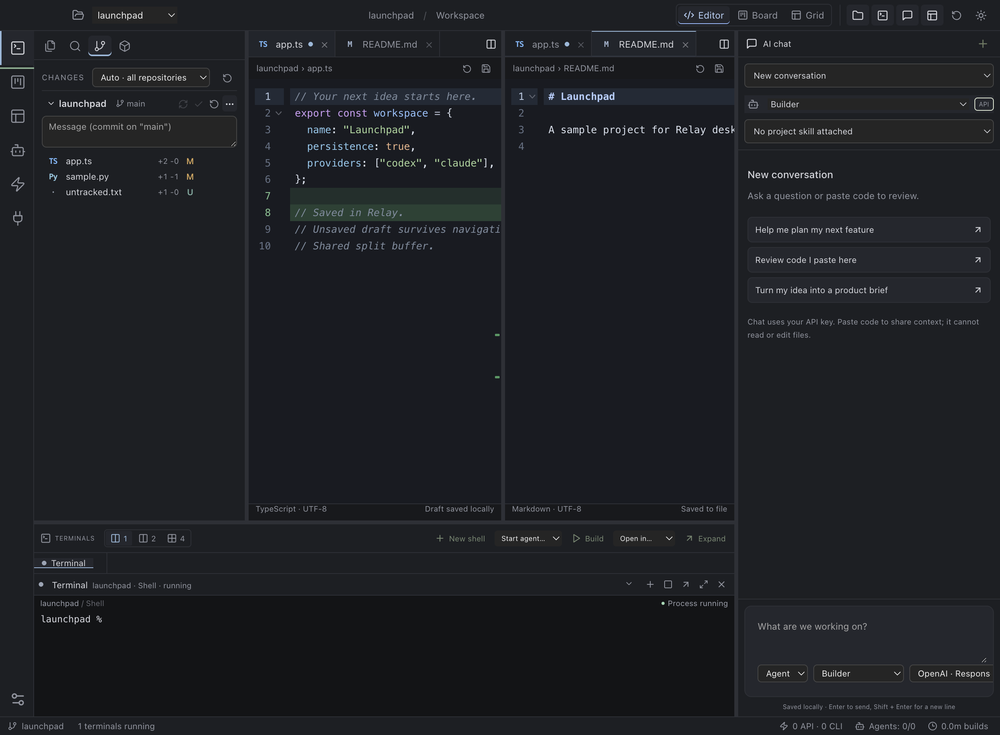
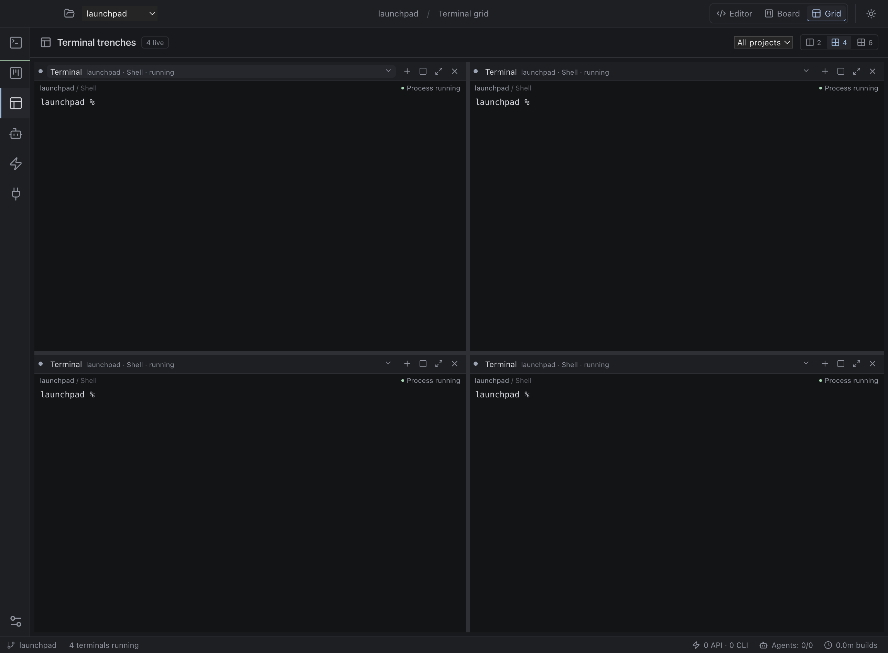
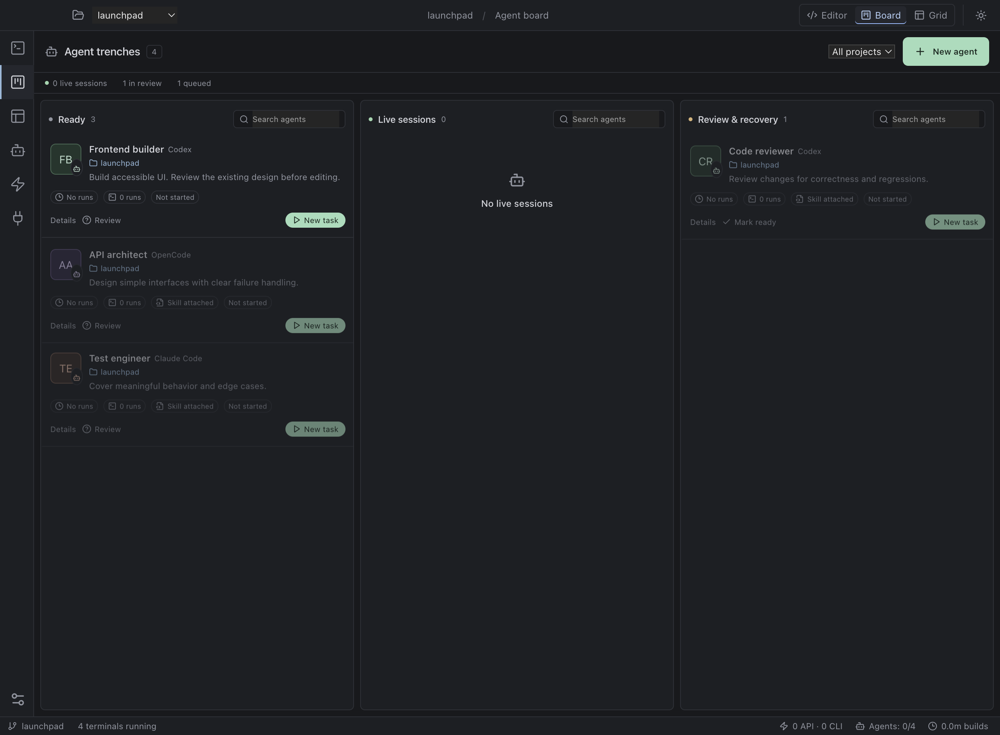
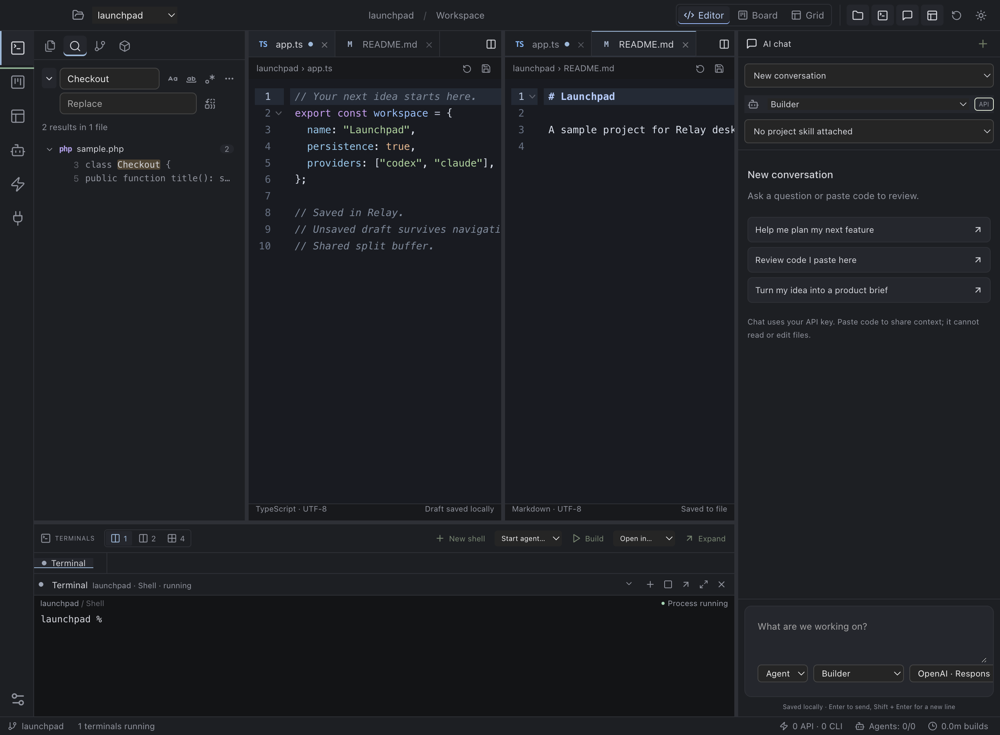

# Relay

**A daily desktop workbench.** A local desktop workspace for entrepreneurs and developers who move between Codex, Claude Code, an editor, and AI chat.

Relay addresses a familiar problem: a terminal closes or the computer restarts, and you have to reconstruct what you were doing. It puts your projects, saved conversations, terminal history, editor tabs and drafts, and usage records in one place.

**Status: desktop alpha 0.5.1.** One Electron codebase targets macOS and Windows. See [validation](docs/VALIDATION.md) for what has actually been tested. This is not yet a hosted service or a production subscription product, and released builds are unsigned.



## Install

There are prebuilt macOS builds on the [releases page](https://github.com/girzsebastian/relay-workspace/releases), but they are **unsigned and not notarized**: macOS will refuse to open them until you allow the app in System Settings → Privacy & Security. Until signing is in place, building from source is the honest recommendation.

## Start locally

Use Node.js **22.12 or newer** and npm. The provider CLIs are installed separately.

```sh
npm ci
npm run build
npm start
```

For development:

```sh
npm run dev
```

Open a project folder. Then use **Codex**, **Claude Code**, **OpenCode**, or **Terminal** in the workspace toolbar. Relay runs those tools on your computer, in that folder. CLI installation detection does not verify login or subscription access.

For a graphical conversation, open **Settings & providers** and choose where chat runs.

- **An installed CLI** (Claude Code, Codex, or OpenCode) runs on this computer with that tool's own login, so chat spends the subscription you already pay for. No API key is required, and the model ID is optional.
  - In **ask** mode a reply is read-only and cannot touch your files: Claude Code with no tools, Codex in a read-only sandbox, OpenCode with its `plan` agent.
  - In **plan** mode the agent may read the project and propose work, but not write.
  - In **agent** mode it edits files. What it may run is governed by the run mode: an allowed list of read and git commands by default, anything outside it raised as an approval card, and an explicit `everything` mode that hands the CLI full permissions. Read [SECURITY.md](SECURITY.md) before using that last one.
- **An API provider** (OpenAI or Anthropic) needs an exact model ID available to your account and an API key, and is billed separately by that provider.

Relay does not convert one subscription into another provider's credits; it runs the tool you selected. No model request is made merely by launching Relay or saving settings.

## What works

- Multiple local projects, restored selected project and view.
- Real PTY terminals using xterm.js and node-pty.
- Official Codex, Claude Code, and OpenCode launched with their existing CLI configuration and authentication.
- Window close hides Relay; processes continue while the app and computer remain running.
- Session records and bounded terminal output survive a full app restart.
- Explicit terminal recovery, with separate records for each run.
- Compact desktop title bar, native menus, activity rail, dark/light themes, and a repository status bar.
- Resizable and hideable explorer, editor, terminal panel, and chat; saved sizes and visibility with a reset command.
- Nested file explorer, up to 20 persistent file tabs per project, two editor groups, shared buffers, syntax highlighting, save shortcut, and detection of conflicting disk edits.
- Terminal grids of 2/4/6 panes; editor terminal panel of 1/2/4 panes. Resize columns/rows, focus a pane, detach it, and reconnect through the session selector.
- Every Codex, Claude Code, and OpenCode session launched through Relay appears on the agent board, including existing saved sessions after migration. Recovery keeps the same agent identity.
- Agents have editable names and instructions, saved memory, an optional project skill, a persistent task queue, and run history. Tasks start explicitly and move to review when their CLI session exits.
- Language-aware code coloring, including PHP, Python, YAML, CSS, HTML, JavaScript/TypeScript, JSON, SQL, shell scripts, and Dockerfiles. File-type badges and measured terminal-output activity add visual context.
- Open the selected project in an installed Cursor or VS Code application.
- Source control across **every repository in the workspace**, not just the folder you opened: a workspace often holds a frontend, a backend and a plugin side by side, and each gets its own branch and upstream state, changed files with per-file line counts, sync, commit, refresh and a full actions menu. Push never creates an upstream silently, and discard never deletes an untracked file.
- Side-by-side diffs with per-hunk **Undo** and **Keep**, and inline decorations in the editor itself: green behind added lines, a stronger green for an added comment, red where lines were removed, a bar beside the changed line numbers, and a strip down the right edge covering the whole file. A file the agent created reads as wholly added rather than `+0 -0`.
- Git decorations in the file explorer, including a mark on folders that contain changes.
- Project search with match case, whole word, regular expressions, and include/exclude globs. Ignored files are skipped, binary files are not scanned.
- A container view listing Docker containers, attributed to a workspace by their compose working directory. Relay starts nothing on its own.
- Settings grouped into categories with a search box across every setting.
- Saved, multi-turn chats backed either by an installed CLI (Claude Code, Codex, OpenCode) or by the OpenAI Responses and Anthropic Messages APIs.
- Agent conversations that **stream what they are doing**: each step as it happens, "Worked for 2m", markdown replies, and a card listing every file that reply changed with a way back. A dropdown above the chat collects every file changed across the whole conversation.
- Three conversation modes (agent, plan, ask) and three run modes. Outside the allowed list, a command becomes an **approval card** — Accept, Skip, or Always allow for this workspace — rather than a silent refusal.
- Agents can open their own **read-only terminal** through a loopback MCP bridge, so "run the dev server" works and you can watch it.
- **Crash recovery you can read**: reopening after a crash lists what was running, when it stopped and what it was doing, taken from what that session actually printed. Sessions with nothing recoverable retire themselves instead of piling up.
- Editor intelligence from the project's own TypeScript service: completions, diagnostics and hover types, answered about the buffer on screen rather than the file on disk.
- Four chat profiles: Builder, Architect, Reviewer, and Product partner.
- Optional project `SKILL.md` instructions attached to new API conversations.
- OS-encrypted API key storage with Electron safeStorage.
- Provider-reported token counts by repository, model, and provider; cache read/write fields. CLI-backed chats report their own token counts too, recorded as `provider-cli`; interactive CLI terminal sessions remain unmeasured.
- Explicit build commands with elapsed wall time and exit status.
- JSON usage export.

The interface contains no fabricated project activity, token counts, credits, or completed work. Any screenshots produced by the test runner use a temporary fixture project.

## Desktop layout

Use the title-bar **Editor / Board / Grid** controls or Cmd/Ctrl+1/2/3. The activity rail opens other tool views. There is no dashboard sidebar or whole-workbench scrolling; file contents, terminal output, conversations, and board columns scroll independently.

Drag a divider to resize it, or focus the divider and use arrow keys. Title-bar buttons and the View menu toggle the explorer, terminal panel, chat, and second editor. **Reset layout** restores default sizes and visibility. Every project retains its own file tabs, unsaved drafts, and expanded directories. Pane sizes and terminal grid preferences belong to the local workspace.

Closing a dirty file tab asks before discarding its draft. Hiding a terminal pane does not stop its process; **Stop** does. Terminal dropdowns can attach any saved session without opening another process. The status bar shows measured API tokens, running/saved agents, and tracked build minutes for the current repository. CLI usage remains explicitly unavailable.

Agents in the same project share that folder's files. Relay keeps one live terminal per agent and preserves the official CLI's approval prompts. “Live session” means a process is running; it does not infer that the model is thinking or that its task is complete. Use **Review** to flag work manually. New task starts a new conversation; open the existing session to continue one.

Open an agent’s **Details** to edit its instructions and memory, queue work, or view previous runs. Saved memory is included with new tasks; it is not inferred from terminal output. Queued tasks require **Start** and never launch automatically after a restart. A CLI session ending moves its task to review; only **Mark done** records completion. The activity graph measures recent terminal output, not model thinking or token use.

Only provider sessions launched using Relay’s controls are indexed automatically. Commands typed inside a general shell and processes started in another application are not detected or imported.

The agent/runtime separation is inspired by [Rakazo](https://github.com/elie222/rakazo). See the [assessment and implementation boundaries](docs/RAKAZO.md).

## What it looks like

|                                                                                                                   |                                                                                                                |
| ----------------------------------------------------------------------------------------------------------------- | -------------------------------------------------------------------------------------------------------------- |
|     |                                     |
| **Source control and inline diff.** Every repository in the workspace, changed lines coloured in the file itself. | **Terminal grid.** Two, four or six persistent PTY sessions, resizable, detachable, reattachable.              |
|                               |                                    |
| **Agent board.** Every Codex, Claude Code and OpenCode session Relay launched, with its tasks and history.        | **Search.** Whole workspace, each repository through its own ignore rules, with globs and regular expressions. |

Screenshots are produced by the test runner against a temporary fixture project. Nothing in them is fabricated activity.

## Exactly what persists

| Event                               | Result                                                                                                                   |
| ----------------------------------- | ------------------------------------------------------------------------------------------------------------------------ |
| Switch views/projects               | Running terminal processes stay in the Electron main process. Output can be replayed when the terminal view returns.     |
| Close the window                    | Relay hides in the Dock/system tray. Terminals continue. Reopen using the tray or Dock.                                  |
| Quit Relay                          | Running processes are interrupted. History and recovery records remain on disk.                                          |
| Force quit, crash, restart computer | Saved state is restored. Previously running work is marked interrupted. No commands are automatically replayed.          |
| Recover a shell                     | Opens a fresh shell in the project directory. Shell variables and the exact prior process state are not restored.        |
| Recover a build                     | Explicitly reruns the command from the beginning.                                                                        |
| Recover Claude Code                 | Uses the conversation UUID assigned when Relay launched it. The official CLI must have saved a conversation for that ID. |
| Recover Codex                       | Opens Codex's project-scoped resume picker. Use **Link ID** to save a UUID from `/status` for exact recovery.            |
| Recover OpenCode                    | Link a session ID from `opencode session list`, then resume that exact ID. Relay never guesses the latest conversation.  |
| Resume API chat                     | Reuses locally saved message history in the next request. An interrupted in-flight request has unknown usage.            |

Claude conversations started outside Relay can be opened with `claude --resume` in a shell. Codex conversations started outside Relay can be opened with `codex resume`. Relay does not import existing CLI transcript archives in this alpha.

Reboot recovery is conversation and workspace recovery, not process checkpointing. A powered-off computer cannot keep compiling or running local agents. Remote compute is outside this product's current scope.

## Skills, MCP, and plugins

Relay discovers project skills from:

```text
.agents/skills/<name>/SKILL.md
.claude/skills/<name>/SKILL.md
```

Select a project skill when creating a chat or a named CLI agent. Its text is saved with that conversation and sent to the selected provider. Discovery is refreshed when selecting another project and returning, or reopening the app. Skills are text instructions here, not executable extensions or permission boundaries.

Codex, Claude Code, and OpenCode terminals use the official tools' own skills, plugins, MCP servers, trust prompts, and approval settings. Use their built-in commands to manage integrations. Existing configuration files such as `.mcp.json` and `.codex/config.toml` can be edited in Relay.

The graphical API chat has **no file, terminal, MCP, web, or agent orchestration tools**. Named agents launch real CLI conversations from the separate Agent board. Paste relevant code to provide context. VS Code extension compatibility is **not implemented**; that requires an extension host and ecosystem licensing/distribution decisions. Use **Open in…** to open the project in Cursor or VS Code alongside Relay.

## Usage semantics

- Usage is **all-time local activity recorded by Relay**, not a provider account balance.
- OpenAI input counts include cached input; cache reads are displayed as a subset and are not added twice.
- Anthropic uncached input, cache reads, and cache writes are separate counters; the input summary includes all three.
- Output counts are whatever the provider reports, including provider-specific accounting semantics.
- Missing token data is **unknown**, not zero. Failed/cancelled requests can incur provider charges that Relay cannot measure.
- Subscription CLI tokens and account quota are **not collected yet**. Typing a build into a general terminal is not classified automatically.
- **Run build** measures elapsed command wall time, not CPU time or compiler-only time. Parallel build durations can sum to more than clock time.
- A running session heartbeats every five seconds. After a crash, duration ends at its last heartbeat, excluding computer downtime. The final interval can be undercounted.
- Dollar cost estimation is deferred until there is a versioned pricing catalog with explicit cache and reasoning rules. Use the provider invoice as billing authority.

## Local data and security

Set `RELAY_DATA_DIR` to an absolute directory to use a separate local workspace profile (also used by packaged-app tests). Otherwise state is in Electron's `userData` directory, normally `~/Library/Application Support/Relay` on macOS and `%APPDATA%/Relay` on Windows:

```text
workspace.json         projects, agents, tasks, memory, sessions, chats, drafts, usage, UI state
workspace.backup.json  previous saved state
credentials.json       OS-encrypted API keys
logs/<uuid>.log        bounded terminal output
```

Workspace saves use a temporary file, fsync, and rename. A corrupt primary file causes startup to stop with the original preserved; the app does not silently reset your workspace. After quitting Relay, restore a known-good backup manually if needed. This is local recovery storage, not an off-device backup service.

Each terminal log is reduced to its latest 512 KiB after passing 1 MiB. This gives bounded recent output, not an unlimited recording or perfect terminal-screen snapshot. Chat history is not automatically pruned.

API keys use OS encryption, and are never returned to the renderer. Chat records, editor drafts, and terminal output are ordinary local files; terminal output can contain secrets printed by programs. Protect the device and backups accordingly. Keys should be re-entered on another computer rather than copying encrypted credentials.

The renderer is sandboxed, has no Node access, uses a restrictive CSP, and receives a bounded IPC bridge. IPC validates sender and payload. File access is scoped to a user-selected project; traversal and symlink escapes are rejected. Files under `.git` and common generated directories are hidden in the explorer. Opening a project does not execute it; using a terminal or a CLI does execute local programs with the user's privileges.

## Build and verify

```sh
npm test                 # core persistence, file safety, lifecycle, API contract tests
npm run build            # typecheck and production renderer
npm run test:desktop     # real Electron / PTY integration, isolated temporary project
npm run pack             # unsigned application directory for this OS
npm run dist:mac         # macOS disk image and ZIP, run on a Mac
npm run dist:win         # Windows NSIS installer, run on Windows
```

The desktop test uses an isolated window and temporary data, runs harmless shell commands, then force-stops and relaunches its own test instance. It briefly exercises window hiding; automation otherwise keeps the window hidden to avoid receiving normal desktop keyboard input. It does not submit real AI requests or read your existing CLI conversations.

The GitHub Actions workflow checks macOS and Windows and uploads unsigned application directories. Check the workflow result for the exact commit being used. Windows native-module builds may require Visual Studio C++ tools if a compatible prebuilt node-pty binary is unavailable. macOS source builds require Xcode command-line tools.

Public releases need Apple signing/notarization and Windows signing. Packaging configuration alone is not proof of Windows runtime compatibility. See [validation](docs/VALIDATION.md).

## Product and implementation

- [Product direction and proposed business model](docs/PRODUCT.md)
- [Architecture and next milestones](docs/ARCHITECTURE.md)
- [Validation evidence and limitations](docs/VALIDATION.md)
- [Contributing](CONTRIBUTING.md)
- [Security model and how to report a vulnerability](SECURITY.md)
- [Code of conduct](CODE_OF_CONDUCT.md)
- [What was asked for, and what is still owed](docs/REQUESTS.md)

Relevant official references: [Codex app server](https://learn.chatgpt.com/docs/app-server), [Claude Code authentication](https://code.claude.com/docs/en/authentication), [Claude integration restrictions](https://code.claude.com/docs/en/legal-and-compliance), [OpenAI Responses](https://developers.openai.com/api/reference/typescript/resources/responses/methods/create), [Anthropic Messages](https://platform.claude.com/docs/en/api/messages/create), [Electron security](https://www.electronjs.org/docs/latest/tutorial/security), and [node-pty](https://github.com/microsoft/node-pty). Provider policies and interfaces can change; recheck before shipping integrations.

Relay is an independent project, not affiliated with OpenAI, Anthropic, Cursor, or Microsoft. The name is a working title; branding availability has not been checked.
