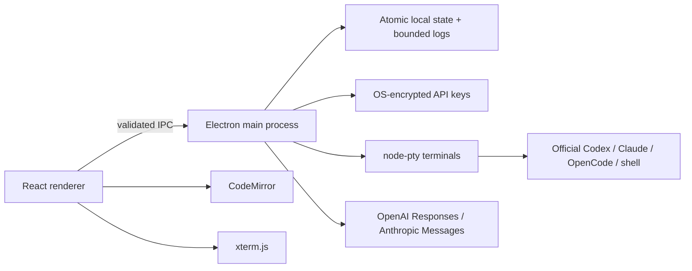

# Architecture

## Current implementation

The renderer has no Node access or provider network access. `desktop/preload.cjs` exposes only a fixed set of operations. `desktop/main.cjs` validates the calling frame and parses each payload with Zod.

`desktop/store.cjs` owns durable state. Workspace updates are synchronous and atomic, favoring simple failure behavior over throughput in this alpha. Terminal output has separate files; the JSON state contains no full terminal buffer. A sequence counter allows the renderer to join a saved-output snapshot and live events without double-appending output received during initial load.

`desktop/terminals.cjs` owns the PTYs. They belong to the main process, not the renderer or a visible terminal tab. Closing the window hides it; full quit stops the main process and PTYs. This deliberately avoids claiming independent daemon persistence. An app crash marks running work interrupted on next load.

`desktop/files.cjs` limits editor access to existing files inside a chosen project and compares content hashes before a save. The editor persists up to 20 tabs per repository (2 MB per file, 8 MB combined draft content), two active editor paths, focus, and expanded directories. Both editor groups share each file buffer. Closing dirty tabs requires a native discard dialog; switching files preserves drafts. Language parsers are loaded on demand from CodeMirror’s official language catalog. Semantic syntax colors and file-type badges cover common application and configuration languages. Theme changes preserve the editor instance and undo history. It does not yet provide new-file creation, refactoring, language servers, or a git diff view.

`desktop/providers.cjs` implements text-only API requests with fixed official HTTPS endpoints. Each chat belongs to a project and fixes its provider, model, role, and skill snapshot at creation. Requests replay saved message history. Provider changes affect new chats; existing chats retain their original identity. Requests time out after three minutes and can be cancelled. Responses are displayed when complete; streaming is a follow-up.

Credentials are stored with Electron safeStorage. Provider keys are decrypted only in the main process. Official CLI credentials are left under the provider CLI's own management.

`desktop/agent-state.cjs` registers each recognized coding CLI session on the board, including saved records migrated at startup. Recovery retains its agent identity. `desktop/agents.cjs` owns editable instructions, manually saved memory, skills, and a persistent task queue. Starting a task snapshots its context and launches an official CLI through the PTY manager. Duplicate active runs are rejected. Exits move tasks to review, interrupted runs remain recoverable, and completion requires an explicit user action. Queued work never starts automatically.

`AgentDetails.tsx` exposes tasks, memory, instructions, and session history. Recent terminal activity is a bounded series of five-second output-byte buckets, not a model-activity detector. Agents share project files; worktree isolation and unattended orchestration remain future work.

`app/EditorWorkspace.tsx`, `TerminalDeck.tsx`, `AgentBoard.tsx`, and `ResizeHandle.tsx` own the desktop interactions. Native menus send allowlisted commands to React. Layout preferences are validated and saved through IPC. The main viewport has fixed geometry; content panes have their own scrolling. Switching or hiding views unmounts terminal renderers without destroying their main-process PTYs.

Existing version-1 state is migrated additively: legacy drafts become tabs; agent/task collections are initialized, existing coding sessions acquire board identities, and interrupted task runs are reconciled; the old overview opens as the editor. The file format version remains 1 for this additive migration.

## Accounting

Each successful API response adds a usage event with project ID, chat ID, provider, model, timestamp, response duration, token fields, and whether usage was reported. Costs are not inferred. Build measurements are terminal run records tagged `build`, with start, heartbeat, end, and exit status.

Failed/cancelled API attempts remain visible on the conversation with an unknown-usage warning; they currently do not produce a reconciled billing event. The UI's successful response count is not a count of all provider requests. A future event ledger should preserve request IDs, retry relationships, and unknown usage records separately from successful completions.

## Next technical work

1. Add schema migrations and SQLite before large workspaces make whole-state writes expensive. Keep startup recovery tests and backups.
2. Introduce a formal provider adapter interface for capabilities, authentication, thread identity, streamed items, approvals, usage, and cancellation.
3. Integrate Codex app server using generated schemas from the installed CLI. Persist provider thread IDs immediately. Display approval requests instead of auto-approving.
4. Add opt-in CLI telemetry with exact repository/session attribution. Prefer documented events and OpenTelemetry rather than scraping screen output or private token stores.
5. Move terminal ownership to a dedicated local service only if persistence across full UI app quits becomes a requirement. Secure local IPC and enforce a single owner. A local service still cannot survive a reboot as the same process.
6. Add a git status/diff pane, project search, terminal search, and named layout profiles. File tabs, split editors, dark/light themes, and the current saved layout are implemented.
7. Add a worker/worktree boundary before allowing multiple coding agents to edit a repository concurrently.
8. Add retention, workspace removal, backup/export/import, and log redaction controls before public release.

## A future subscription service

The optional service would store account membership, entitlements, encrypted workspace metadata, skill collections, and usage summaries. Local repositories and CLI/API credentials should remain local by default. Device keys, encryption recovery, revocation, offline behavior, conflict resolution, and shared-workspace ACLs need a separate reviewed design.

No network sync service, account system, payment integration, telemetry collector, or remote execution service is included in this repository today.
